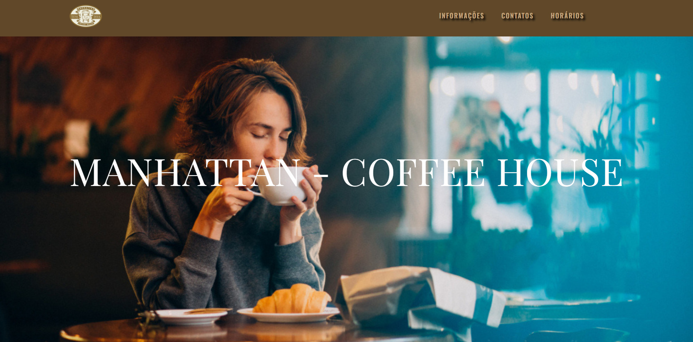

# ☕ Projeto Cafeteria

Projeto desenvolvido durante meus estudos de **Desenvolvimento Web**, com o objetivo de praticar a criação de uma página para uma cafeteria, aplicando conceitos de **HTML5 e CSS3**.

O projeto simula o site de uma cafeteria, apresentando seus produtos, informações e opções de contato, com uma interface simples, organizada e responsiva.

---

## 📌 Sobre o projeto

O **Projeto Cafeteria** foi desenvolvido como um projeto de aprendizado para colocar em prática os conhecimentos adquiridos durante meus estudos de desenvolvimento web.

A proposta foi criar uma página visualmente agradável para uma cafeteria, trabalhando principalmente a estruturação do conteúdo, organização dos elementos e estilização da interface.

---

## 🚀 Tecnologias utilizadas

- HTML5
- CSS3

---

## 💻 Funcionalidades

- Página inicial com apresentação da cafeteria
- Seção de produtos
- Apresentação do cardápio
- Informações sobre a cafeteria
- Seção de contato
- Navegação entre as seções da página
- Layout responsivo

---

## 📚 O que aprendi

Durante o desenvolvimento deste projeto, pude praticar:

- Estruturação de páginas utilizando **HTML semântico**
- Organização de conteúdo utilizando diferentes elementos HTML
- Estilização de páginas utilizando **CSS**
- Utilização de **Flexbox**
- Organização e alinhamento de elementos
- Trabalho com imagens e elementos visuais
- Organização de arquivos e pastas de um projeto web

---

## 🌐 Acesse o projeto

[**Acesse o site**](https://projeto-cafeteria-vert.vercel.app)

---

## 📷 Preview

---

## 👨‍💻 Desenvolvido por

**Bruno Barros**

Desenvolvido como parte dos meus estudos em **Desenvolvimento Web**.